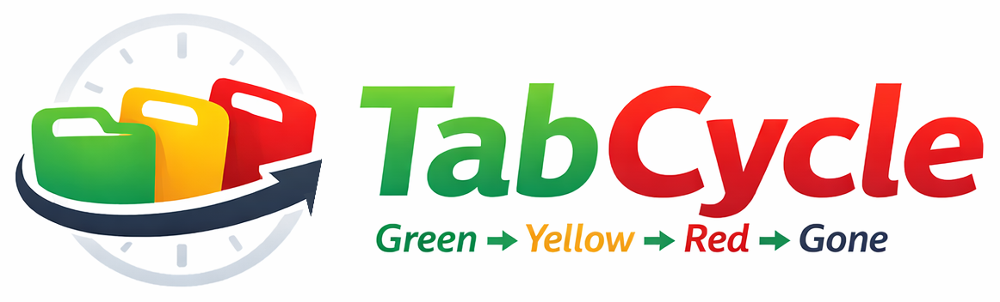

# TabCycle



A Chrome extension that manages the lifecycle of opened tabs with refresh-time tracking, status-based coloring, intelligent tab sorting, and automatic tab/group cleanup.

## Features

- **Tab Age Tracking**: Tracks how long each tab has been open using global active time or wall-clock time
- **Status Transitions**: Tabs progress through Green → Yellow → Red → Gone based on configurable thresholds
- **Special Groups**: Ungrouped aging tabs are automatically sorted into "Yellow" and "Red" tab groups
- **Group Zone Sorting**: User-created tab groups are color-coded and sorted into zones (Green | Yellow | Red)
- **Smart Tab Placement**: New tabs are placed contextually based on the active tab's group
- **User Control Preserved**: Manual group names, ordering within zones, and tab moves are never overridden
- **Multi-Window Support**: Global active time with per-window sorting
- **Session Persistence**: Tab ages and statuses persist across browser restarts

## Installation

1. Clone this repository
2. Open Chrome and navigate to `chrome://extensions/`
3. Enable "Developer mode" (toggle in top-right)
4. Click "Load unpacked" and select the `src/` directory
5. The extension is now active

## Configuration

Open the extension options page (`chrome://extensions/ → TabCycle → Details → Extension options`) to configure:

- **Time Mode**: Active time (only counts while Chrome is focused) or Wall Clock (real elapsed time)
- **Thresholds**: When tabs transition between statuses
  - Green → Yellow (default: 4 hours)
  - Yellow → Red (default: 8 hours)
  - Red → Gone/Close (default: 24 hours)

## Permissions

| Permission | Purpose |
|-----------|---------|
| `tabs` | Track tab creation, removal, and navigation |
| `tabGroups` | Create/manage special groups and zone sorting |
| `storage` | Persist tab metadata and settings |
| `alarms` | 30-second evaluation cycle |
| `webNavigation` | Detect page navigation to reset tab refresh time |

## Development

```bash
# Install dependencies
npm install

# Run all tests
npm test

# Run unit tests only
npm run test:unit

# Run integration tests only
npm run test:integration
```

## Architecture

```
src/
├── manifest.json              # Manifest V3 configuration
├── background/
│   ├── service-worker.js      # Event listeners and evaluation cycle
│   ├── state-persistence.js   # Storage read/write with validation
│   ├── time-accumulator.js    # Global active time tracking
│   ├── status-evaluator.js    # Tab status computation
│   ├── tab-tracker.js         # Tab metadata management
│   ├── tab-placer.js          # Context-aware new tab placement
│   └── group-manager.js       # Special groups, zone sorting, colors
├── options/
│   ├── options.html           # Settings page
│   ├── options.js             # Settings logic
│   └── options.css            # Settings styling
└── shared/
    ├── constants.js           # Enums, keys, defaults
    ├── logger.js              # Structured logging
    └── schemas.js             # Storage schema validation
```

## How It Works

1. Every 30 seconds, the service worker evaluates all tracked tabs
2. Each tab's age is computed (active time elapsed since last navigation)
3. Tabs transition through statuses based on thresholds
4. Ungrouped tabs aging to Yellow/Red are moved into special groups
5. User-created groups are color-coded and sorted into zones
6. Tabs reaching "Gone" status are automatically closed
7. All state persists to `chrome.storage.local` for crash recovery
